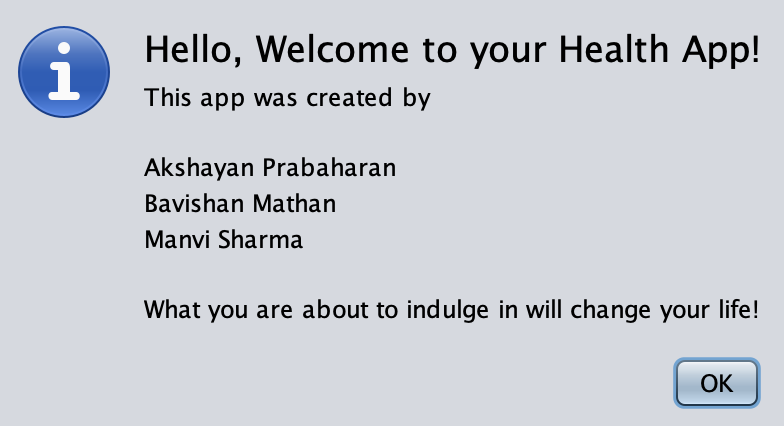
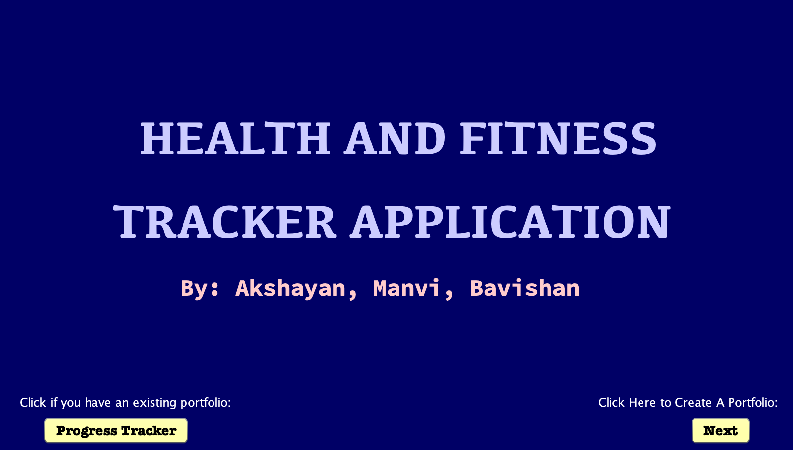

## Health and Fitness Tracker App

# Overview
* The Health and Fitness Tracker App is a Java-based application with a graphical user interface built using Java Swing. It provides users with personalized health insights by tracking their sleep, meal plans, and fitness routines. The app leverages Object-Oriented Programming (OOP) and File I/O to store and process user data effectively.

# Features

* Sleep Monitor: Tracks sleep duration and provides recommendations for better rest.

* Meal Planner: Suggests meal plans based on eating habits and goal weight.

* Fitness Planner: Generates exercise routines tailored to the user’s body mass and fitness goals.

* User Input: Users enter body mass, height, sleep habits, eating patterns, and target weight.

* Personalized Plans: Uses stored data to generate a structured fitness and diet plan.

* Data Persistence: Saves user progress and preferences using File I/O.

# Technologies Used

* Java: Core programming language for logic and application flow.

* Java Swing: Used for designing the user-friendly graphical interface.

* File I/O: Stores and retrieves user data persistently.

* OOP Principles: Modular code structure using encapsulation, inheritance, and polymorphism.

# Setup Instructions

* Clone the Repository

* Open the Project in NetBeans

* Build the Project

* Using the App

* Enter user details.

* View and follow generated health recommendations.

# Future Enhancements

* Integration with an online database for cloud storage.

* Mobile-friendly version using JavaFX or Android development.

* AI-driven recommendations for better personalization.

  
  &nbsp;&nbsp;&nbsp;&nbsp;
  

